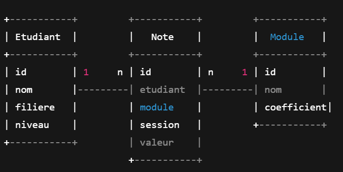

# Suivi des Notes Scolaires

## Objectif du projet
Ce projet vise à gérer efficacement le suivi des notes des étudiants. Il permet de centraliser les informations concernant les étudiants, les modules et leurs notes, et fournit des fonctionnalités pour analyser les performances académiques.

---

## Fonctionnalités du projet
- Ajouter, modifier et supprimer un étudiant ou un module.  
- Enregistrer une note pour un étudiant dans un module.  
- Calculer la moyenne générale d’un étudiant.  
- Afficher toutes les notes d’un module.  
- Filtrer les informations par filière et par session.  
- Visualiser graphiquement la moyenne des notes par module.  

---

## Modèle Conceptuel de Données (MCD)



## Structure du Projet Gestion-Notes scolaires 
```md
Gestion-Notes/
├── Source Packages/
│   └── ma/projet/
│       ├── entities/
│       │   ├── Etudiant.java
│       │   ├── Module.java
│       │   ├── Note.java
│       │   ├── User.java
│       │   └── EmailUtil.java
│       │
│       ├── dao/
│       │   └── IDao.java
│       │
│       ├── service/
│       │   ├── EtudiantService.java
│       │   ├── ModuleService.java
│       │   ├── NoteService.java
│       │   └── UserServices.java
│       │
│       ├── ui/
│       │   ├── Connexion.java
│       │   ├── EtudiantForme.java
│       │   ├── FlitrageForme.java
│       │   ├── ForgotPassword.java
│       │   ├── Main.java
│       │   ├── ModuleForme.java
│       │   ├── MoyenneForme.java
│       │   ├── NoteForme.java
│       │   ├── SignUp.java
│       │   └── StatistiqueForme.java
│       │
│       └── util/
│           └── Connexion.java
│
├── Test/
│   ├── TestEtudiant.java
│   ├── TestModule.java
│   ├── TestNote.java
│   └── TestUser.java
│
└── Libraries/
    ├── mysql-connector-j-9.5.0.jar
    ├── javax.mail.jar
    ├── jcommon-1.0.23.jar
    ├── jfreechart-1.5.3.jar
    └── JDK 1.8 (Default)
```
## Vidéo de démonstration (Demo video)
https://github.com/user-attachments/assets/b394188c-e370-42d2-a611-7050ec8a0390

## Auteur
**Nom :** Aya AIT EL HARCH  
**Cours :** Introduction à Python  
**Date :** Décembre 2025  
**Encadré par :** Pr. Mohamed LACHGAR
